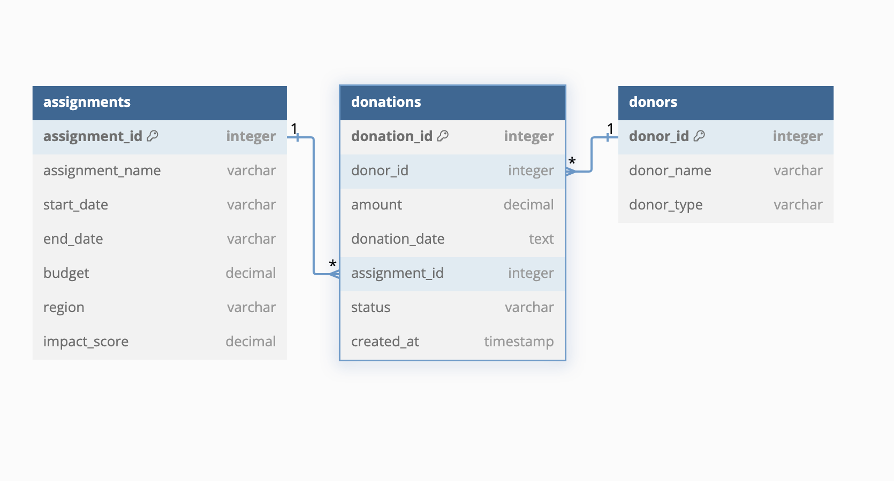

GoodThought NGO has been a catalyst for positive change, focusing its efforts on education, healthcare, and sustainable development to make a significant difference in communities worldwide. With this mission, GoodThought has orchestrated an array of assignments aimed at uplifting underprivileged populations and fostering long-term growth.

This project offers a hands-on opportunity to explore how data-driven insights can direct and enhance these humanitarian efforts. In this project, you'll engage with the GoodThought PostgreSQL database, which encapsulates detailed records of assignments, funding, impacts, and donor activities from 2010 to 2023. 

This comprehensive dataset includes:

- **`assignments.csv`:** Details about each project, including its name, duration (start and end dates), budget, geographical region, and the impact score.
- **`donations.csv`:** Records of financial contributions, linked to specific donors and assignments, highlighting how financial support is allocated and utilized.
- **`donors.csv`:** Information on individuals and organizations that fund GoodThought’s projects, including donor types.

Refer to the below ERD diagram for a visual representation of the relationships between these data tables:

## Project Instructions
Write SQL queries to answer the following questions:

1) List the top five assignments based on total value of donations, categorized by donor type. The output should include four columns: assignment_name, region,  rounded_total_donation_amount rounded to two decimal places, and donor_type, sorted by rounded_total_donation_amount in descending order. Save the result as highest_donation_assignments.

2) Identify the assignment with the highest impact score in each region, ensuring that each listed assignment has received at least one donation. The output should include four columns: assignment_name, region, impact_score, and num_total_donations, sorted by region in ascending order. Include only the highest-scoring assignment per region, avoiding duplicates within the same region. Save the result as top_regional_impact_assignments.